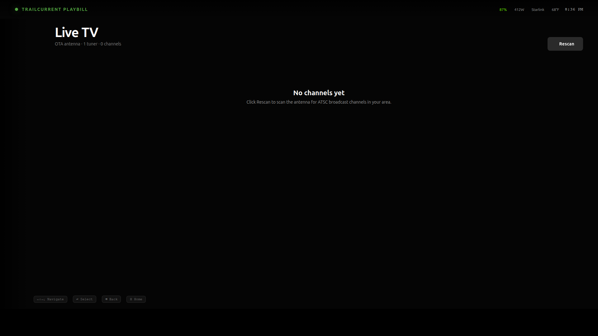
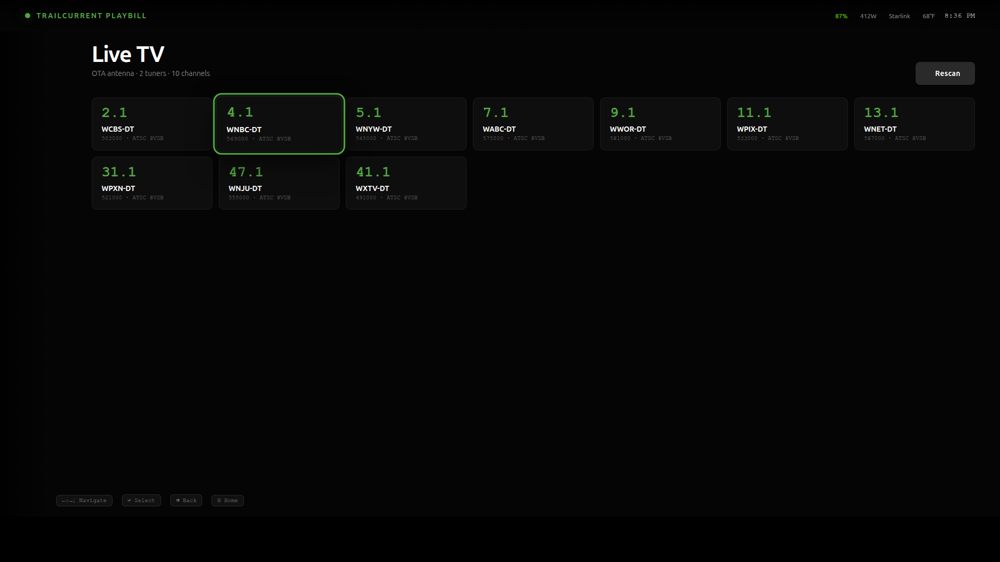

# Live TV

OTA antenna TV via the Hauppauge **WinTV-dualHD** (USB ATSC tuner, model **01595**, USB ID `2040:826d`). Two simultaneous tuners — watch one channel while another records, or capture two conflicting shows.

> Recording isn't wired up yet. Today the Live TV screen handles channel scan, channel picking, and hardware-decoded fullscreen playback. Recording lands in a later phase.

> **Single-tuner scope**: Playbill currently supports exactly this model. Other DVB USB devices won't bind because the Q6A kernel ships no USB-DVB drivers; we add the specific drivers this tuner needs via a DKMS package (see "Kernel drivers" below). Adding a different tuner means adding another module subtree to `playbill-dvb-dkms` and rebuilding.

## What you need

| | |
|---|---|
| Tuner | Hauppauge WinTV-dualHD, **model 01595 only** (USB ID `2040:826d`) |
| Antenna | OTA antenna connected to the tuner's RF input |
| Userspace tools (already in the Q6A image) | `dvb-tools`, `dtv-scan-tables`, `mpv` |
| Kernel drivers (NOT in the Radxa BSP kernel — shipped via `playbill-dvb-dkms`) | `em28xx` (USB bridge) + `em28xx-dvb` (DVB extension) + `lgdt3306a` (ATSC demod) + `si2157` (RF tuner) + `tveeprom` (Hauppauge EEPROM parser) |

The earlier "this tuner uses `dvb_usb_cxusb`" claim in older revisions of this doc was wrong — `2040:826d` is matched by `em28xx-cards.c` as `EM28174_BOARD_HAUPPAUGE_WINTV_DUALHD_01595`. The cxusb driver and the dualHD share a vendor name and a similar form factor, but the underlying USB bridge chip on the 01595 is an Empia EM28174.

Verify the tuner is visible after plugging it in:

```bash
lsusb | grep 2040:826d                  # USB device present?
lsmod | grep -E 'em28xx|lgdt3306a|si2157'   # drivers loaded?
ls /dev/dvb/                                # adapter0/ and adapter1/ — one per tuner
```

If `/dev/dvb` is missing, the kernel hasn't bound a driver — either the DKMS modules aren't installed (verify with `dkms status | grep playbill-dvb`) or the build failed against the current kernel. Re-seat the USB cable and check `dmesg | tail` for em28xx bind messages.

### Why not in-tree?

The Radxa Q6A kernel package (`linux-image-6.18.2-N-qcom`) ships the DVB core but **zero USB-DVB bridge drivers** — no `em28xx`, no `dvb_usb_cxusb`, no `au0828`, none. We ship the missing modules as an out-of-tree DKMS package so the Radxa BSP kernel can stay untouched (display/Venus/Iris/audio depend on it) and the modules get auto-rebuilt against whatever kernel apt installs next. The DKMS source lives in [`image/dkms/playbill-dvb/`](../../image/dkms/playbill-dvb/).

## Opening the screen

Sidebar → **Live TV** (the TV-outline icon, third from the top).


> *Screenshot to capture: the sidebar with Live TV focused / hovered, expanded state showing the label.*

## Empty states

The screen tells you what's wrong before you can scan. The four states you'll see, in order from "everything's broken" to "ready":

| State | Cause | Fix |
|---|---|---|
| **DVB tools not installed** | `dvbv5-scan` / `dvbv5-zap` missing | `sudo apt install dvb-tools dtv-scan-tables` |
| **No tuner connected** | `/dev/dvb` empty — driver hasn't bound | Re-seat the USB cable; check `dmesg \| grep em28xx`. If `lsmod` shows no `em28xx`, the DKMS modules failed to build — run `sudo dkms status` and check `/var/lib/dkms/playbill-dvb/*/build/make.log`. |
| **No channels yet** | Tuner present but no channel scan has been run | Click **Rescan** |
| **Channel grid populated** | Ready | Pick a tile to start watching |


> *Screenshot to capture: Live TV view with tuner disconnected — should show the green hardware-chip-outline icon and the "No tuner connected" message.*

## Running a channel scan

1. Click **Rescan** in the top-right.
2. The button switches to a spinning **Scanning…** label.
3. The app runs `dvbv5-scan -A 1 -O DVBv5 -o ~/.config/trailcurrent-playbill/channels.conf /usr/share/dvb/atsc/us-Center-frequencies-8VSB`.
4. On a strong antenna signal a scan takes 1–3 minutes (it walks the entire US ATSC frequency table).
5. When it finishes, the channel grid populates.



> *Screenshot to capture: Live TV with the Rescan button showing the spinning sync icon and "Scanning…" label.*

The scan results live at `~/.config/trailcurrent-playbill/channels.conf` (DVBv5 INI format). Re-running a scan overwrites this file. Deleting it is harmless — the next scan re-creates it.

## Picking a channel

Each channel is a focusable tile showing:

- **PSIP virtual channel number** (e.g. `5.1`, `7.2`) in TrailCurrent green
- **Station / network name** below
- **Carrier frequency + modulation** (e.g. `563 MHz · ATSC 8VSB`) in mono small text



> *Screenshot to capture: Live TV channel grid populated with several stations, one tile in the focused state (green outline + scaled up).*

Navigate with the arrow keys. Press **Enter** (or click the tile) to tune.

While the tuner locks the signal, the focused tile glows green and shows a small **TUNING…** badge. Once mpv is up, the tile state clears and the screen handoff happens.


> *Screenshot to capture: a channel tile mid-tune, showing the green border + glow + "TUNING…" badge in the top-right corner.*

## Watching

When tuning succeeds, an mpv window takes over the full screen. Hardware decode flags:

```
--hwdec=auto-safe        → MPEG-2 / H.264 decode on the Adreno Venus V4L2-M2M codec
--vo=gpu-next            → modern OpenGL / Vulkan video output
--profile=fast           → tuned for 1080p60 on the Q6A
```

This is what we worked so hard to enable on the Q6A — frames decode in fixed-function silicon, not on the CPU.

| Key | While watching |
|---|---|
| **Esc** | Stop playback, back to the channel grid |
| **q** | Same as Esc |
| **m** | Mute / unmute |
| **9 / 0** | Volume down / up |
| **f** | Toggle fullscreen (already fullscreen by default) |


> *Screenshot to capture: mpv playing a TV channel fullscreen — ideally on a real broadcast so you can see the picture decoding cleanly. No OSD by default.*

## Where data lives

| Path | What |
|---|---|
| `~/.config/trailcurrent-playbill/channels.conf` | Scan results in DVBv5 INI format. Persistent. |
| `/tmp/playbill-runtime/tunerN.ts` | Live MPEG-TS being captured from adapter `N` while watching. Ephemeral — wiped at boot. mpv reads from here. |
| `/tmp/playbill-runtime/mpv.sock` | mpv's JSON IPC control socket. Used by the app for stop / volume / mute commands. |

## Troubleshooting

**"dvbv5-scan exited 1: ..."**
Usually means the antenna isn't connected or the signal is too weak to lock any frequencies. Try a different antenna position or a powered amplifier.

**"dvbv5-zap exited N before lock: ..."**
The tuner saw the channel during scan but can't lock it for live playback. Often a marginal-signal channel. Re-scan with the antenna better positioned, or pick a stronger channel.

**Channel grid is populated but every tile shows `—` for the channel number**
Some firmware revisions report the SERVICE_ID without the major/minor split. Functionally fine — the tiles still tune by name. The display will improve when the scan parser is upgraded to read the full PSIP table.

**mpv opens but the screen is black / glitchy**
Check that hardware decode is binding correctly:
```bash
mpv --hwdec=auto-safe --msg-level=vd=v /tmp/playbill-runtime/tuner0.ts
```
The first lines of output should mention `using hardware decoding (v4l2m2m)` or similar. If it falls back to software decode, see [docs/SETUP.md](../SETUP.md#step-8--verify-the-gpu--4k-hardware-video-decode) for the GPU verification steps.

**"OTA antenna · DVB tools missing" stays on screen even after `apt install dvb-tools`**
The probe is cached in the renderer state. Reload with **Ctrl+R**.

**`/dev/dvb` doesn't appear after plugging in the tuner**
The DKMS modules aren't loaded. Diagnose:
```bash
dkms status | grep playbill-dvb           # should show "installed" for the current kernel
lsmod | grep em28xx                       # should show em28xx + em28xx-dvb
sudo modprobe em28xx                      # manual load if not autoloaded
journalctl -k -n 80 | grep em28xx         # bind / firmware / probe messages
```
If DKMS shows no entry, reinstall: `sudo apt install --reinstall playbill-dvb-dkms`. If the build failed, check `/var/lib/dkms/playbill-dvb/*/build/make.log`.

## Future work

- **Recording** — surface a Record button on each channel tile, persist captures under `~/Videos/playbill/`.
- **EPG** — parse the PSIP EIT tables that the tuner is already pulling and show "now / next" on each channel tile.
- **Restream to other devices** — the TS file at `/tmp/playbill-runtime/tunerN.ts` is the tap point. An ffmpeg sidecar can segment it to HLS in parallel with mpv, served from a small Express endpoint that the Headwaters PWA pulls. See [architecture.md](./architecture.md) for the seam.
- **Remote control from the Headwaters PWA** — channel-up / channel-down / mute / power, talking to the same control surface mpv listens on.
