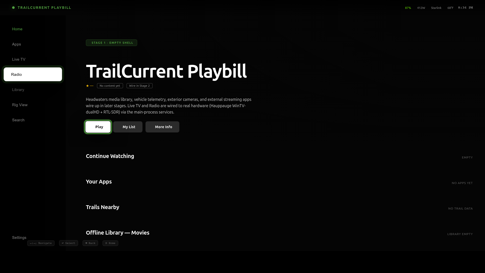
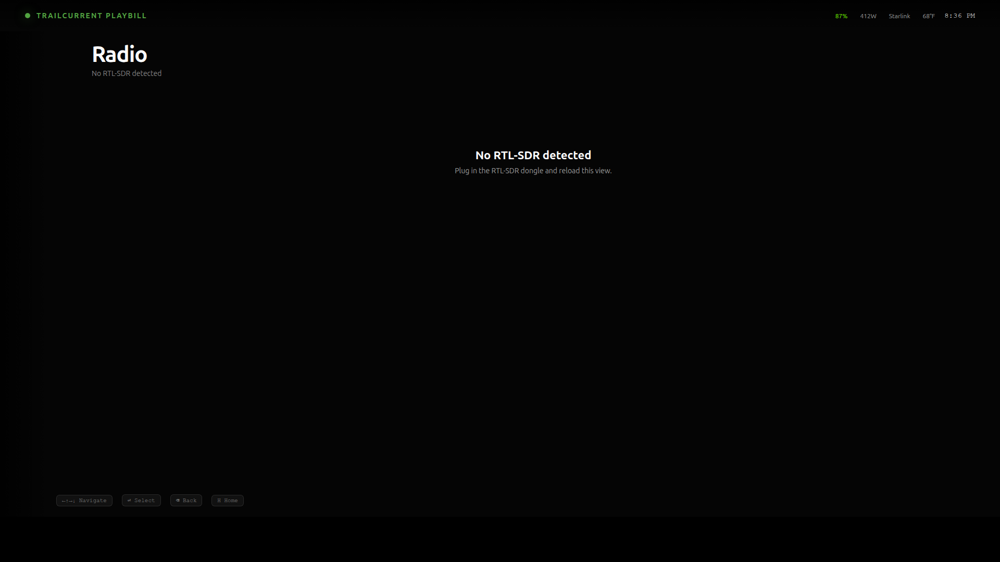
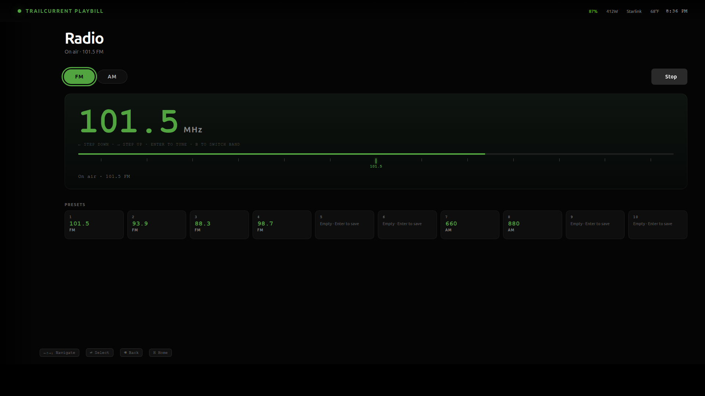
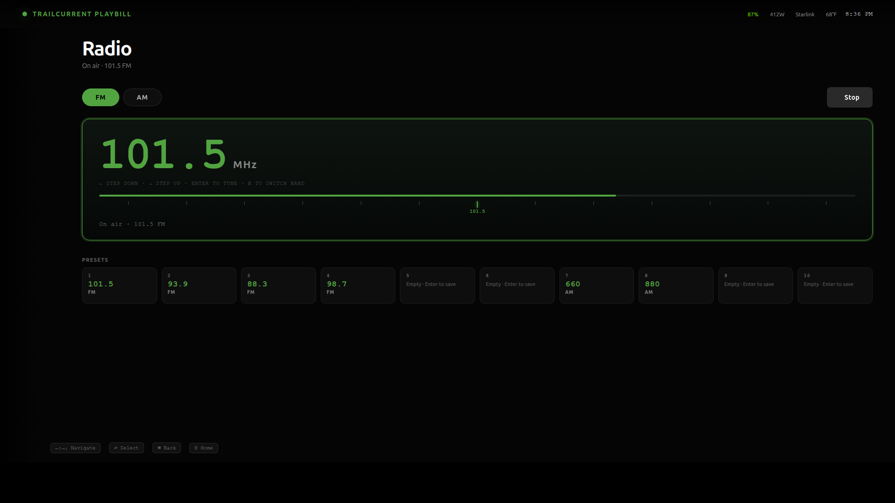
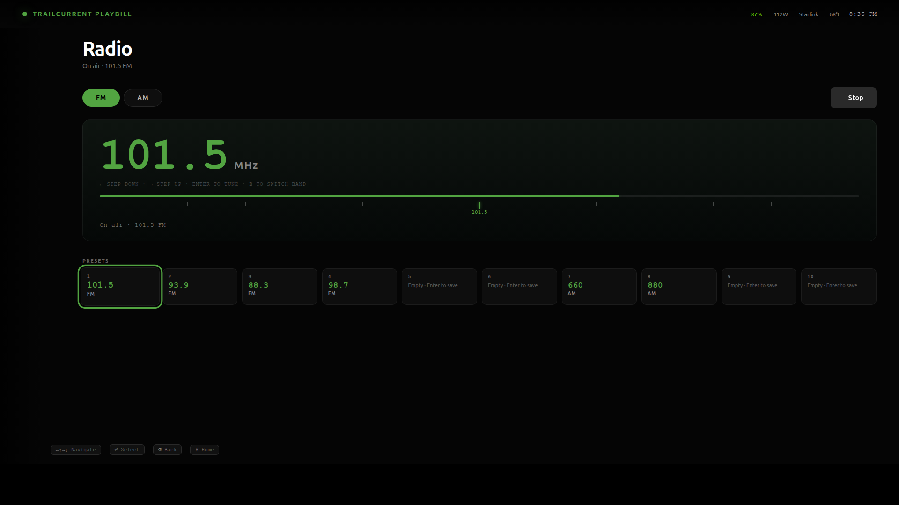

# Radio

AM and FM broadcast radio via an **RTL-SDR USB dongle**. Tested with the RTL-SDR Blog V4 and Nooelec NESDR Smart v5; any RTL2832U-based dongle that librtlsdr supports will work.

## What you need

| | |
|---|---|
| Dongle | RTL-SDR Blog V4 (best AM performance) or Nooelec NESDR Smart v5 (FM-focused) |
| Antenna | Whip antenna for FM; longer wire for AM. Both dongles ship with a couple of suitable antennas. |
| Software (already in the Q6A image) | `rtl-sdr` (`rtl_fm`, `rtl_test`), `pipewire` (`pw-cat`) |
| Kernel module **blacklist** | `dvb_usb_rtl28xxu`, `rtl2832`, `rtl2830` — the image's [`disable-unused.conf`](../../image/files/modprobe/disable-unused.conf) handles this so librtlsdr can claim the device |

Verify the dongle is visible:

```bash
rtl_test -t
# Should list: "  0:  Realtek, RTL2838UHIDIR, SN: ..."
# Should NOT say: "Kernel driver is active, or device is claimed by second instance"
```

If you see "kernel driver is active," the DVB blacklist isn't taking effect — `sudo modprobe -r dvb_usb_rtl28xxu` and re-plug the dongle.

## Opening the screen

Sidebar → **Radio** (the radio-outline icon, fourth from the top).



> *Screenshot to capture: the sidebar in expanded state with the Radio entry focused.*

## Empty states

| State | Cause | Fix |
|---|---|---|
| **rtl_fm not installed** | userspace tools missing | `sudo apt install rtl-sdr` |
| **No RTL-SDR detected** | dongle not plugged in OR DVB driver claimed it | Plug the dongle; verify with `rtl_test -t` |
| **Standby** | dongle ready, nothing playing | Pick a frequency and tune |
| **On air** | rtl_fm running, audio flowing | — |



> *Screenshot to capture: Radio view with the dongle unplugged, showing the green hardware-chip-outline icon and "No RTL-SDR detected" message.*

## Layout

The Radio screen has three focusable rows, top to bottom:

```
┌──────────────────────────────────────────────────────────────────┐
│ [ FM ] [ AM ]                              [ Stop ]              │  ← radio-band
├──────────────────────────────────────────────────────────────────┤
│                                                                   │
│   101.5  MHz                                                      │
│   ←  STEP DOWN · → STEP UP · ENTER TO TUNE · B TO SWITCH BAND     │
│   ──────────●─────────                                            │  ← radio-dial
│   On air · 101.5 FM                                               │
│                                                                   │
├──────────────────────────────────────────────────────────────────┤
│  PRESETS                                                          │
│  ┌──┬──┬──┬──┬──┬──┬──┬──┬──┬──┐                                 │
│  │ 1│ 2│ 3│ 4│ 5│ 6│ 7│ 8│ 9│10│                                 │  ← radio-presets
│  └──┴──┴──┴──┴──┴──┴──┴──┴──┴──┘                                 │
└──────────────────────────────────────────────────────────────────┘
```



> *Screenshot to capture: full Radio view with FM band selected, dial at a real station, a couple of presets filled in.*

## Band selector

Two buttons: **FM** (default, 87.5–108 MHz, 200 kHz steps) and **AM** (530–1700 kHz, 10 kHz steps). The active band is filled green. Switching bands resets the dial to the band's default starting frequency.

You can switch bands with the mouse, with Enter while focused, or — much faster — with the **B** key while focused on the dial.

## Dial

The big number is the frequency you're about to tune (or, when the radio is running, the frequency you ARE tuned to). Below it sits the dial strip — a horizontal bar showing the surrounding 12 (FM) or 20 (AM) channels with the current channel marked in green.

| While focused on the dial | |
|---|---|
| **←** | Step down by one channel (200 kHz FM, 10 kHz AM) |
| **→** | Step up by one channel |
| **Enter** | Tune to the displayed frequency — calls `rtl_fm` and starts streaming |
| **B** | Toggle band (FM ↔ AM) |
| Click a tick on the strip | Jump to that frequency and tune immediately |

The "On air" line below the strip shows the actual playing frequency (which lags the displayed cursor until you press Enter).



> *Screenshot to capture: close-up of the dial — the big "101.5 MHz" number, the hint line, the strip ticks, the cursor positioned on a tick that has the frequency label visible.*

## Presets

Ten persistent slots, stored in `~/.config/trailcurrent-playbill/radio-presets.json`. Slots 1–6 default to FM, 7–10 default to AM, but **any slot can store any band** — the band is captured when you save.

| Action | How |
|---|---|
| **Save current frequency to a slot** | Click an empty slot · Right-click any slot to overwrite |
| **Recall a slot** | Click a filled slot · Or arrow-focus it and press **Enter** |
| **Clear a slot** | Not yet — manually edit `radio-presets.json` |

A filled preset shows the frequency in green mono and a small `FM` / `AM` badge. An empty slot shows "Empty · Enter to save."



> *Screenshot to capture: the preset row with a few slots filled (showing frequencies + band badges) and a few empty.*

## Stop / Standby

When something is playing, a **Stop** button appears next to the band selector. Stopping kills `rtl_fm` and `pw-cat` and returns the radio to standby. Audio output stops immediately.

If you tune a different frequency while the radio is already running, the previous session is killed and a new one starts — no need to Stop first.

## Audio path

`rtl_fm` is spawned with band-appropriate args:

| Band | Mode | Sample rate | Audio rate | Extras |
|---|---|---|---|---|
| FM | `wbfm` | 200 kHz | 48 kHz | `-E deemp` (75 µs US deemphasis) |
| AM | `am` | 12 kHz | 12 kHz | — |

Raw S16LE PCM is piped into `pw-cat -p --raw` which writes to PipeWire's default sink (the Q6A's built-in 3.5mm headphone jack by default). No file is written; the audio is purely live.

## Troubleshooting

**"rtl_fm produced no audio within 3s"**
Most often: dongle USB connection is loose, OR the kernel re-claimed the device after a hot-plug. `rtl_test -t` and re-check the modprobe blacklist.

**Audio comes through but is heavily distorted on FM**
You're probably tuned to an empty channel and hearing white noise. Try a known local station (Wikipedia "Radio stations in $YOUR_CITY" has a list).

**AM works on the V4 but is unusable on the Nooelec v5**
Expected — the v5 uses R820T2 with direct-sampling Q-branch mode, which has weaker AM sensitivity than the V4's R828D + built-in upconverter. See the conversation that led to picking these dongles.

**Volume is too loud / quiet**
The system volume controls (PipeWire) apply. There's no per-radio volume in the app yet — adjust via the GNOME volume keys or `pavucontrol`.

**Tuning hangs the UI for a second**
`rtl_fm` start-up takes ~100–500 ms to lock. The "Tuning…" status is shown during that time. If it hangs longer than ~3 s the operation aborts with an error.

## Future work

- **Per-radio volume slider** in the app (independent of system volume).
- **Signal-strength meter** (RTL-SDR exposes RSSI; a small bar in the dial would help when scanning unfamiliar bands).
- **RDS decoding** for FM — `rtl_fm` doesn't do RDS itself, but `redsea` (already in Ubuntu universe) can be tee'd off the same RF stream to display station name, song title, etc.
- **Remote control from the Headwaters PWA** — same backend service surface, exposed over HTTP. See [architecture.md](./architecture.md).
